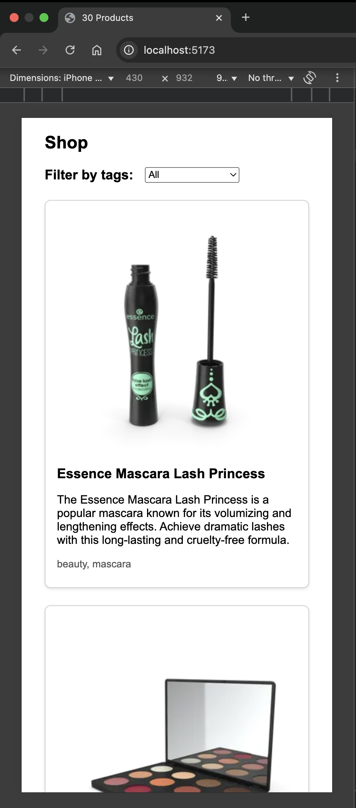

# Feature requirement

We want you to implement the following features : 

- You have a dumb list of products, we want you to populate the data from an API (https://dummyjson.com/products), you are allowed to use a fetching library like axios.

- Add client-side search field.
- Add a select to sort cards based on name.
- Add a select to sort cards based on categories.

- Transform text to a simple card (refer to designs in requirement-designs folder)

